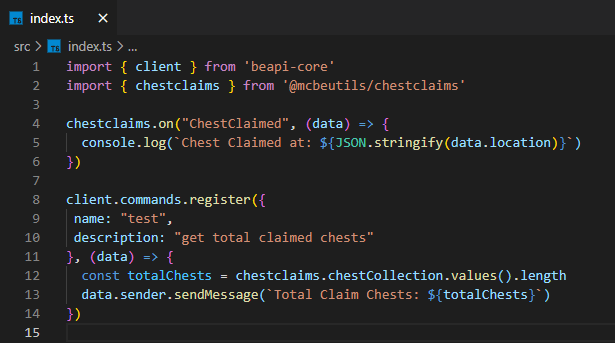

# ChestClaims

ChestClaims is a [BeAPI](https://github.com/MCBE-Utilities/BeAPI) module that allows players to claim and protect their chests.

## Installing
* Requirements
  * [node.js](https://nodejs.org/)
  * [BeAPI](https://github.com/MCBE-Utilities/BeAPI)

To download and install, you can either git clone this repo and use the mcpe pack, or run the command below in your BeAPI project.
```npm install @mcbeutils/chestclaims```
Once you have done that, you can now import "@mcbeutils/chestclaims" into your main project.
